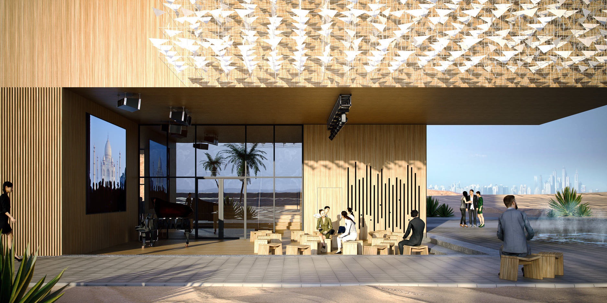
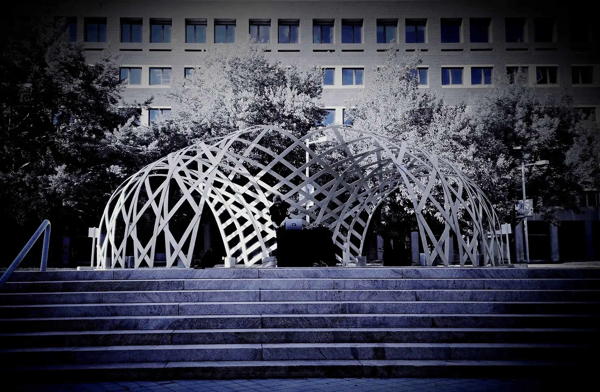
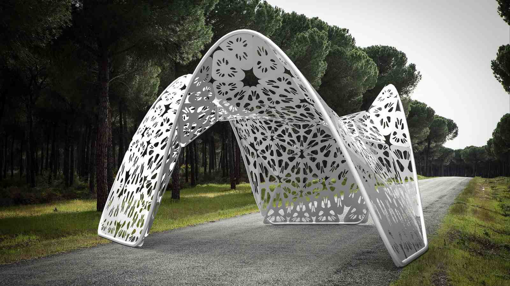
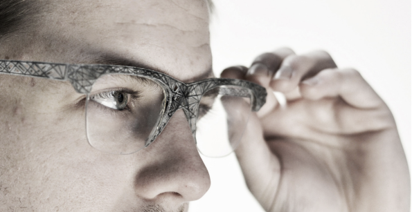

### 2022-2024 OPTIshell - Asymptotic Gridshell

[Fab Academy - Judy Curie - Final Project](https://fabacademy.org/2023/labs/ciudadmexico/students/judyta-cichocka/projects/final-project/)

[project website](https://optishell.io/)

OPTIshell timber gridshell deliver the best structural-energy performance at a minimal cost while providing outstanding aesthetics.
OPTIshell is an asymptotic gridshell based on a minimal surface. The structure is fabricated with planar straight strips of material with no waste and assembled from a flat bi-directional grid.

### 2020 - Polish Pavilion for EXPO2020 - pv instllation

[more about the project](https://lnkd.in/dEekaGpv)

Perovskite PV installation on the Polish Pavilion for EXPO 2020. Project prepared and realized with Saule Technologies.

### 2019 INFRAME -  Geodesic Gridshell

[project website](https://judytacichocka.wixsite.com/inframe)

[MIT Digital Structures Group](http://digitalstructures.mit.edu/page/design#inframe-elastic-timber-gridshell)

The INFRAME pavilion is a temporary timber elastic gridshell structure built on the MIT campus in September 2019 as part of Judyta Cichocka's CEE MEng thesis.  The structure transforms the function of the public staircase between buildings E15 and E25 on the MIT campus into a performance area. A single layer gridshell becomes a real temporary outdoor stage for electronic music performances, a canvas for a video-mapping show, and has multiple imaginary roles invented by potential next owners. The ultimate goal of the project was to design an elastic timber gridshell, which can be constructed in real-life scenario, providing a functional space for experimental artistic performances and which endeavors to embody the principles of structural art: economy, efficiency and elegance. The challenge lied in development of the design strategy, which allows rapid construction by a small group of inexperienced builders at minimum cost while complying to the building code in Massachusetts (which was required by MIT).

### 2016 Hiriwa Pavilion -  Metal Shell Pavilion

[A winning visit for international design student](https://www.wgtn.ac.nz/news/2016/04/a-winning-visit-for-international-design-student)

Hiriwa pavilion is an experimental structure which endeavors to reinterpret the function of steel, and uses steel as textile or fabric. The perforated steel plates form a lattice membrane for a small outdoor pavilion.

### 2015 Katipo -  Multimaterial 3D-printed eyewear

[project website](https://youreshape.io/reshape15-digital-outlook/)

 HONORABLE MENTION, RESHAPE15 | WEARABLE TECHNOLOGY COMPETITION. Honorable mention for the design of eyeglass frames using evolutionary structural
optimization techniques, project presented at four international exhibitions in Barcelona and Rome,
Awarding institution: NOUMENA, IN (3D) INDUSTRY

### More projects coming soon
