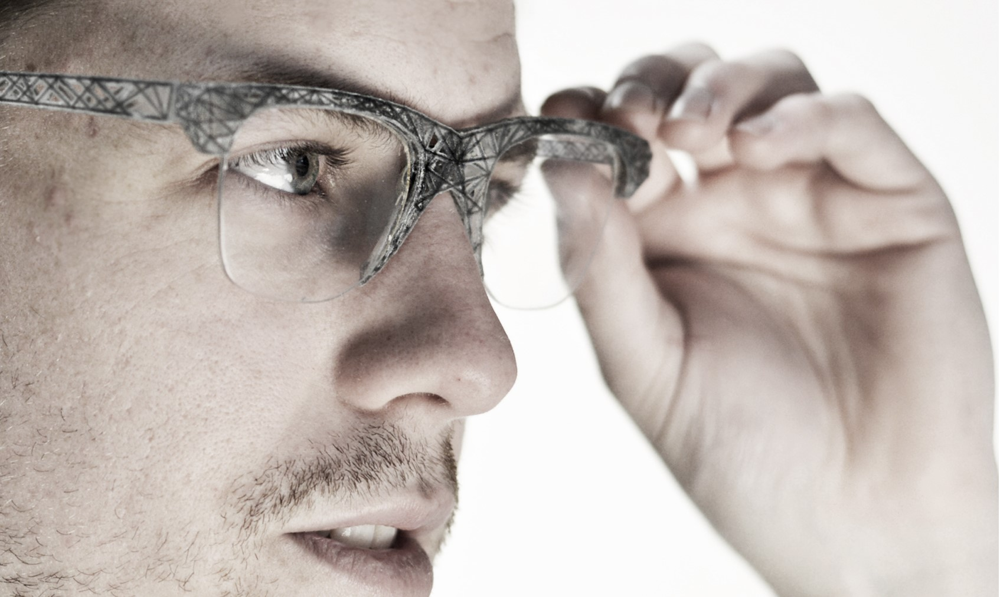

### 2015 Katipo -  Multimaterial 3D-printed eyewear

<video width="1130"  controls>
  <source src="../../../assets/art/Katipo-Haptic.mp4" type="video/mp4">
</video>

[project website](https://youreshape.io/reshape15-digital-outlook/)

 HONORABLE MENTION, RESHAPE15 | WEARABLE TECHNOLOGY COMPETITION. Honorable mention for the design of eyeglass frames using evolutionary structural
optimization techniques, project presented at four international exhibitions in Barcelona and Rome,
Awarding institution: NOUMENA, IN (3D) INDUSTRY
