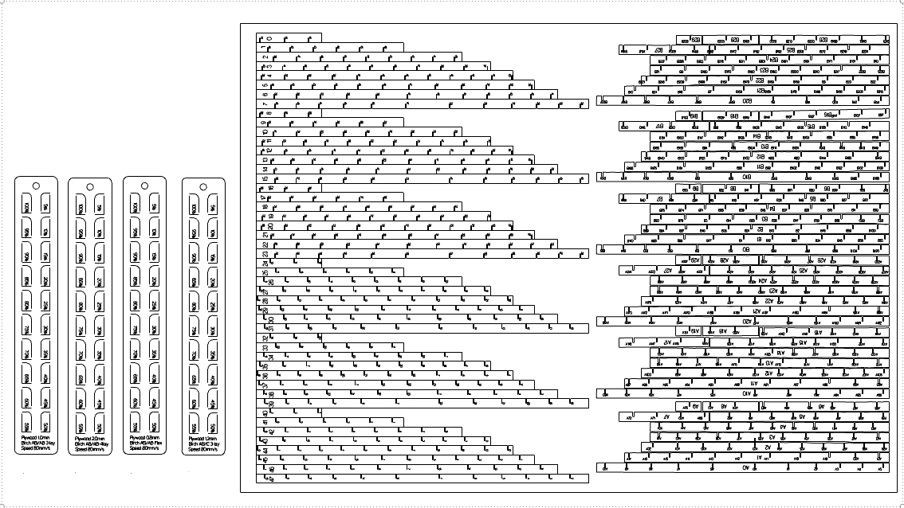
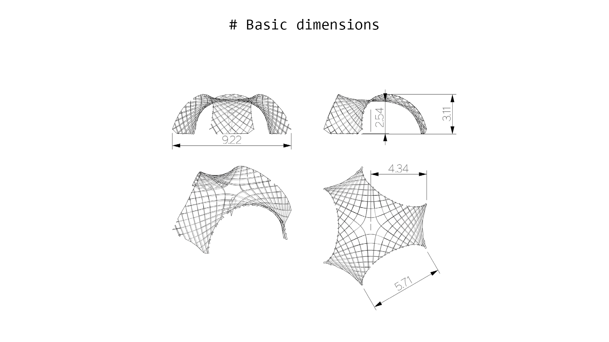
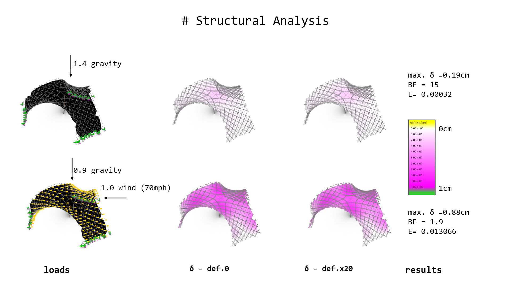
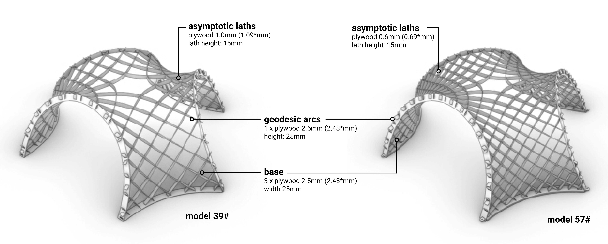
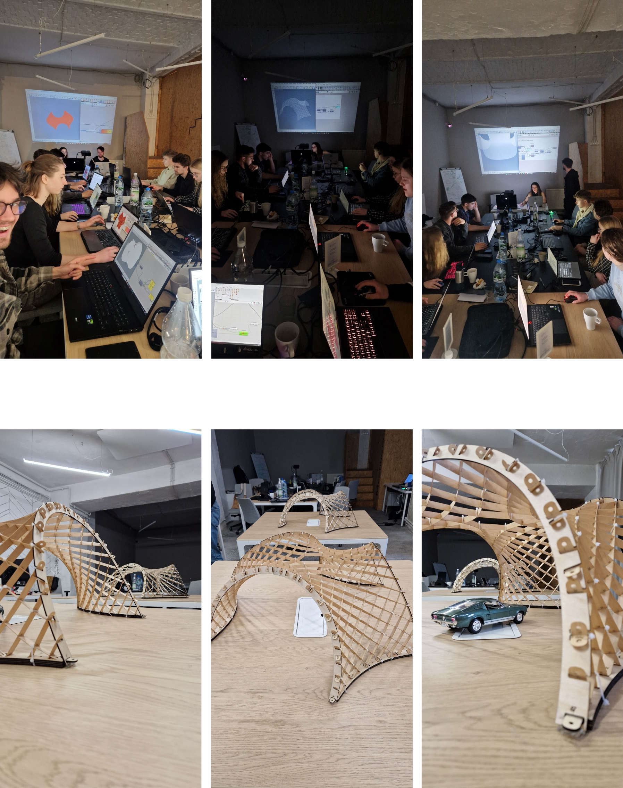
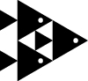

#**2022-2024 OPTIshell **

A smarter method for architectural design optimisation
A subfield of engineering, architectural design optimisation (ADO) can prove useful when designing zero energy buildings. However, ADO's impact remains rather restricted due to the lack of optimisers dedicated to multi-objective constrained optimisation problems (CMOPs) and the absence of industry-validated evidence on ADO benefits. The EU-funded OPTIshell project will fit ADO with an innovative optimisation algorithm based on swarm intelligence (SI) apposite for CMOPs. The results will provide decisive information on the applicability of SI methods for CMOPs in the design domain and will demonstrate ADO benefits through the optimisation and construction of the solar timber gridshell prototype powered by flexible perovskites modules.

[link](https://cordis.europa.eu/project/id/101033646)
_____
# **OPTISHELL-GENERAL Information**
This project has received funding from the European Union’s Horizon 2020 research and innovation programme under the Marie Skłodowska-Curie grant agreement No 101033646

**Grant**:Horizon 2020, MSCA IF, OPTIshell (EU funding: 101033646)

**Title**:A framework for the multi-objective optimization of timber gridshells under structural and energy-based criteria.

**Acronim**: OPTIshell

**Host Institution**: Saule Technologies, PL

**Realization Time** 01.03.2022 - 29.02.2024

**Objective**:
The OVERALL OBJECTIVE of OPTIshell was to introduce into ADO the optimization algorithm based on Swarm Intelligence dedicated for constrained, multi-objective optimization problems (CMOPs) and demonstrate the ADO benefits through the optimization and construction of solar timber gridshell CarPort4.0. To reach this overall objective, the project focused on 4 specific objectives:

- **Objective 1**: Implementation of the constrained multi-objective Particle Swarm Optimization (CMOPSO) algorithm in a design tool and benchmarking.
- **Objective 2**: Creating a parametric model of CarPort4.0 and formulation of the solar energy collection and mass minimization as a CMOP.
- 3)	Objective 3: Evaluation of the importance of internal tuning on the performance of the CMOPSO algorithm.
- 4)	Objective 4: Physical construction of the randomly selected valid solution (CarPort4.0) and the optimal solution (CarPort4.0+) to prove the benefits of ADO.

**Results**

- Goldfish Optimizer
	- Software
	- publication
	- manual
	- design application: Living Knitwork PAVILION

- Asymptotic GRIDSHELL
  	- design as CMOP formulation
    - prototypes
    - publications
    - wrokshps
    - lecture
____

#**OPTISHELL-Asymptotic GRIDSHELL**

 

 **Fig.** Conceptual model.

##**01 - Architectural Design**

 I reviewed some research papers about asymptotic gridshells.

 1. Asymptotic Gridshells - applications and analysis. [paper](https://www.behance.net/gallery/86066625/MT-Asymptotic-Gridshells-applications-and-analysis)

 2. DESIGN AND CONSTRUCTION OF THE ASYMPTOTIC PAVILION [paper](https://mediatum.ub.tum.de/doc/1468899/1468899.pdf)

 3. The design, fabrication and assembly of an asymptotic timber gridshell. [paper](https://www.researchgate.net/publication/336367443_The_design_fabrication_and_assembly_of_an_asymptotic_timber_gridshell)

 4. Morphology of Kinetic Asymptotic Grids. [paper](https://eikeschling.com/2022/09/23/morphology-of-kinetic-asymptotic-grids/)

 5. Designing Asymptotic Geodesic Hybrid Gridshells. [paper](https://eikeschling.com/2022/09/05/designing-asymptotic-geodesic-hybrid-gridshells/)

  “if surface is completely minimal, the asymptotics in the gridshell will coincide perfectly perpendicular, which result in torsion-free nodes and straight strips” (Eike Schling, 2018)

 **Design goal**

 A small scale roof structure/ a canopy, which can be built without a building permit, providing a sheltered space from the rain and the sun.

 -  1) timber grisdshell based on the radiation optimized surface

 -  2) structurally sound timber gridshell from flat straight planks

 -  3) site-sptung erection: assembly from flat

 -  4) approx. coverage area 35m2 (min. height 2.6m, max. outer radius 5m)

 **Geometric Requirements**

 

 **Table 1.** Geometric requirements for asymptotic gridshell.

 **Proposals V1 V2**

 Taking into consideration the geometric requirements, 2 subsurfaces were cut out of the minimal surface Enneper 3. The asymptotic curves were found with the custom-scripted component for Grasshopper.

 
 **Fig 1.** Geometric comparison of the V1 and V2 proposals.

 Two proposal V1 and V2 can be built as a stand-alone structures. However for the modular assembly is important for the possibilities to cover large spaces. Some modular arrangements are presented below.

 
 **Fig 2.** Modular arrangements - top view.

 
 **Fig 3.** Modular arrangements - isometry.

##**02- Prototyping Fabrication**

 I prepared the first model from the thin plywood to test the unrolling script.

### **Simulation & Reality**

 <video width="960"  controls>
   <source src="../../../assets/science/SimulationTD500.mp4" type="video/mp4">
 </video>

 <video width="960"  controls>
   <source src="../../../assets/science/WhatsApp Video 2023-02-13 at 19.02.52.mp4" type="video/mp4">
 </video>

 movies availeble on Youtube
 - [simulation](https://youtube.com/embed/Mqb7dUGRLO0)
 - [model folding](https://youtube.com/embed/Y_U2DWwXKLk)

### **Design & Fabrication**

 The beauty of asymptotic gridhshell lies in the ease of fabrication. The 3D laths unroll to  flat starlight strips which can be manufactured by laser, milling or even by hand.

 

 To produce below fabrication layout, I prepared a custom Python script for unrolling and labeling of the elements and joints. The code produces layout for the bottom layer of the asymptotics.

 
 The script accounts for the laser beam size (kerf), material thickness, width of the material and tolerances.
 
 The joint connection shape can be rectangular or defined by custom draw curve.

 
 

 **Key take aways:**

  - the material thickness was around 0.88mm, and the slot had 1mm width, not taking into account kerf, allowing on the rotation around 75deg -> this caused difficulty to assemble it in the flat state, but also triggered the self-assembly effect
  - larger tolerances on joints cause that elements that has few connections required fastening to not fall off from the flat model state

  **Next steps:**

   - accounting for kerf, and the mobility of 60 deg will help in the flat assembly, but decrease the self assembly "willingness"
   - self-interlocking joint would allow to keep the larger tolerances and prevent from falling of elements in the flat state

##**03 - Structural Analysis: Single vs Double Layer**

 **Design Workflow**

 Realizing the complexity of the asymptotic gridshell design enabling erection from a flat grid.

 

 source: 
Schling, E., &#38; Schikore, J. (2022). Morphology of Kinetic Asymptotic Grids. In C. Gengnagel (Ed.), <i>DMS 2022, Towards Radical Regeneration</i> (pp. 374–393). Springer Nature Switzerland.

 **Structural Analysis**

 Lath: 10cm width, 2x6.5mm thickness (double)

 Material: wood 'birch' E:910[kN/cm2] G12:360[kN/cm2] G3:360[kN/cm2] gamma:4.5[kN/m3] alphaT:5.0E-6[1/C°] ft:3.8[kN/cm2] fc:-3.8[kN/cm2]

 Total mass: 131.504203kg

 <video width="960"  controls>
   <source src="../../../assets/science/230329_analysis.mp4" type="video/mp4">
 </video>
 **Video.** Double layer: Deformation of the structure factorized 0-20: Left - gravity, Right: Wind.

 |Analysis|    Gravity                      | Wind 0.365kN/m2|
 | ----------- | ------------------------------------ |--|
 |Load Case| 1.4D | 0.9D + 1.0W|
 | displacement [cm]     | 1.8 | 2.87|
 | Buckling Factor    | 79| 49|

 Lath: 10cm width, 6.5mm thickness (single)

 Material: wood 'birch' E:910[kN/cm2] G12:360[kN/cm2] G3:360[kN/cm2] gamma:4.5[kN/m3] alphaT:5.0E-6[1/C°] ft:3.8[kN/cm2] fc:-3.8[kN/cm2]

 Total mass: 65.752102kg
 <video width="960"  controls>
   <source src="../../../assets/science/230329_analysis6.5.mp4" type="video/mp4">
 </video>
 **Video** Single layer: Deformation of the structure factorized 0-20: Left - gravity, Right: Wind.

 |Analysis|    Gravity                      | Wind 0.365kN/m2|
 | ----------- | ------------------------------------ |--|
 |Load Case| 1.4D | 0.9D + 1.0W|
 | displacement [cm]     | 5.7 | 17.8|
 | Buckling Factor    | 25| 8|
 |Energy|0.009754 |0.087255|

 **Key take aways:**

  - double-layer necessary for timber structures (or alternative stiffening strategies for single layer structure)

  - the stiffness scaled model should account for double layer thickness in real pavilion

##**04 - Simulation & Angle Calculation (tolerances indication)**
 Simulation of assembly-disassembly with different rotation DOF at joints.

 

 **Key take aways:**

  - the angle between joints change more further from the center -> joints closer to legs(supports) need more rotational freedom

  - the joints should allow movement 75-90 deg (more is not necessary e.g. most right example)

##**05 - Structurally Feasible 1:1 model**

 For the kinetic-actuated assembly with simple joints (cuts in the laths), I have to keep the structure of the asymptotic gridshell from a single layer of asymptotic laths. However, as the structural analysis shows above, the structure is too weak with the single layer plywood laths 6.5mm thick. Increasing thickness is not possible due to the bending (thicker material cannot bend that easily and can easily break- causing structural failure). The project assumption is to use kinetic movement for assembly (and maybe disassembly), preferably only once in the Life Cycle of the structure - to assemble it on the site. The assembly device should work as assembler of the structure and not as a kinetic actuator for the kinetic sculpture. Therefore to keep the single layer of the asymptotic grid (which can be easily assembled from flat), I added a developable plates, which will be mounted between laths after assembly to check the structural performance.

 
 
 
 
 
 
 

 **Key take aways:**

  - assuming the 1:1 gridshell structure with filling developable plates the structural performance is satisfactory

  **Next steps:**

   - calculation of the material thickness for 1:5 stiffness scaled model  -> testing the kinetic joints with tolerances - > preparation of the fabrication files

##**06 - Stiffness-scaled models**
 Calculating the thickness of plywood for stiffness-scaled model 1:5.

 |Analysis Model|   1:1          | 1:5|
 | ----------- | ----------------- |--|
 |Load Case 1.4D|6.4mm x 10cm, single, **5cm** | disp.**1cm**, thickness x width: 0.5mm x 20mm|
 |Load Case 1.4D|6.4mm x 10cm, single + 0.5mm thick plates, disp.**0.19cm** | **0.04cm**, xx|
 |Load Case 1.4D|6.4mmx10cm, double, **1.8cm** |thickness x width: 1.0mm x 20mm, disp.**0.34cm**|

 **Grasshopper-Karamba Analysis**: [gh -file](../files/final/230510_V2_analysis.gh){: 230510_V2_analysis }

 
 **Fig.**. Stiffness scaled model. Left: The real structure laths 6.5mmx100mm double layer, Birch plywood, Right: model 1:5 laths 1mmx20mm, single layer Birch.

 **Key take aways:**

  - considering stiffness-scaling, already for 1:5 scale, I need a very thin plywood of 0.8mm-1mm, therefore the 1:5 scale was considered as suitable for prototype

**Defining structurally sound shell thickness**

  The shell structural analysis was conducted with Karamba3d. assuming the subsurface is a shell of constant thickness, uniformly supported at all edges (Fig.2), made with birch plywood with the following properties: Elasticity Modulus (E) = 8750MPa, Bending Strength, Density (𝛠) = 450kg/m3, Compressive Strength (fco) = 38MPa. For this project structurally sound shell is characterized by at L0: 1.4 Dead Load with the Max. displacement <2.83cm, Buckling Factor BF>5 and Utilization U<20% and at LC1:  1.2Dead Load and 1.0 Wind: BF > 5, Util < 25%.

 
 **Fig.**Boundary condition for the shell analysis.

- Surface Area: 55,71m2
- Thickness: 5mm
- Volume: 0,27853048 m3

LC0:
 - Dipl [cm]: 0.059006
 - BL Fact: 54.396208
 - Util: -0.2% - 0.2%

 LC1:
  - Dipl [cm]: 0.095024
  - BL Fact: 6.542279
  - Util: -1.0% - 0.7%

**Grid Densities & Lath Parameters**

In order to find asymptotic grids of equivalent material volume of the proposed shell, a few asymptotic grids variations were generated (Table 4), assuming shell in 1:10 scale of surfacer area 0,557061m2 and 0.5mm thickness, resulting in 0,0002785305m3 of the material volume.

 

 **Table.**Analysis of grid densities and cross section of equivalent volume

 
 **Fig.**3D models of the selected prototypes.

##**07 - IP, Planning**

 CC - Creative Common License:
 

 **Key take aways:**

 - I have also reviewed CC licenses and chose: Attribution-NonCommercial 4.0 International (CC BY-NC- 4.0).

##**08 - Rotation freedom**

 material thickness = t

 Slot size for (not accounting for kerf/beam size):

 - **90** = 1t
 - **75** = 1.22t
 - **60** = 1.36t
 - **45** = 1.42t

 To achieve these exact sizes for slots, the beam size (or kerf if materials melts substantially) should be subtracted from the result.

 Example:
 Material thickness = 1mm, we would like to allow for 60 degree rotational freedom, the beam size/kerf of the laser used 0.05mm:

 - slot size (NOT accounting for kerf) = 1mm * 1.36 = 1.36mm
 - slot size (accounting for kerf) = 1mm * 1.36 - 0.05 = 1.31mm

**Model 57**

 Plywood 0.6mm (real 0.69mm)
 kerf with the
 Speed 100 Power 100 on the small slot (1mm)- 0.3mm both sides / 0.15mm one side

 if t = 0.69mm
 - **75** = 1.22*0.69 = 0.8418

 *if the slot in the laser cut will have 0.6mm, in reality it will result in the slot 0.9mm and will allow for 75 rotation movement*

**Model 39**

 Plywood 1.0mm (real 1.09mm)
 kerf with the
 Speed 100 Power 100 on the small slot (1mm)- 0.3mm both sides / 0.15mm one side

 if t = 1.09mm
 - **75** = 1.22*1.09 = 1.3298

 *if the slot in the laser cut will have 1.0mm, in reality it will result in the slot 1.3mm and will allow for 75 rotation movement*
##**09 - Structural Analysis of the models**
 In order to verify if the seleced asymptotic and built asymptoric gridshell protoypes are structurally sound and exhinbit simil structural perfomance both computational structural analysi and physical tests were performed. As the actual thickness of the selected materials varied slightly form the assumed dimensions, the volumes of the gridshell protype Model 39# = 0.21045kg and Model57 = 0,194542kg. Simulating dead load we accouted for this proportion in the structural analysis perforemed wtih Kiwi3D.
 
  **Fig.**Structural analysis models – Kiwi3d.
##**10 - Fabrication and Assembly**

 **Fig.** Protypes construction.

 **Fig.** Protypes construction.

 ___________
#**OPTISHELL-GOLDFISH optimizer**

Within the OPTIshell project a multi-objective version of the recent Constraint Multi-Swarm Particle Swarm Optimization without Velocity (CMPSOWV) is developed.  With the focus on wider adoption of optimization aimed at solving multi-objective constrained engineering design problems in practice, the proposed method is implemented in the popular Grasshopper framework as a new optimization plug-in “Goldfish”.  As CMPSOWV, the MOCMPSOWV algorithm is supposed to obtain highly diversified optimization results thanks to incorporating the multi-swarm approach and the enlarged search scope for the best solution in the multiple locations of the hyperspace.  The introduced MOCMPSOWV algorithm in the Goldfish framework has proven its superiority over algorithms such as: MOPSO, NSGA-II, SPEA, SPEA2, MOGA, MOEA/D in the quality of solution criteria and computing time in the engineering design problems such as: Welded beam case, Pressure Vessel case and multi-objective test functions.
__________________________________________
#**Links**
[Fab Academy project](https://fabacademy.org/2023/labs/ciudadmexico/students/judyta-cichocka/projects/final-project/)

[EU project site](https://cordis.europa.eu/project/id/101033646)

#**Files**
**OPTISHELL grishell: Workshop exercises and fabrication files**: [GITHUB Files](https://github.com/fabfndpl/optishell/tree/41a8e458d51e29fe1f000b189494174c1059c014/240316_OPTIshell_Workshop-20240408T222050Z-001)

**OPTISHELL grishell publicaion**: [available soon]

**GOLDFISH plugin & manual**: [GOLDFISH.zip](../../../assets/science/goldfish/goldfish.zip){: GOLDFISH.zip}

**GOLDFISH optimizer publicaion**: [available soon]

**Suplemenaty material for publication**:[Data, tables, graphs and figures referencing to the calculations and results](https://github.com/symonloj/MOCMPSOWV)
