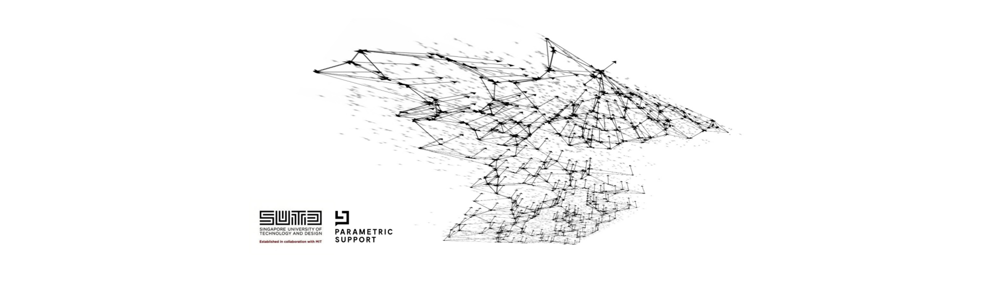
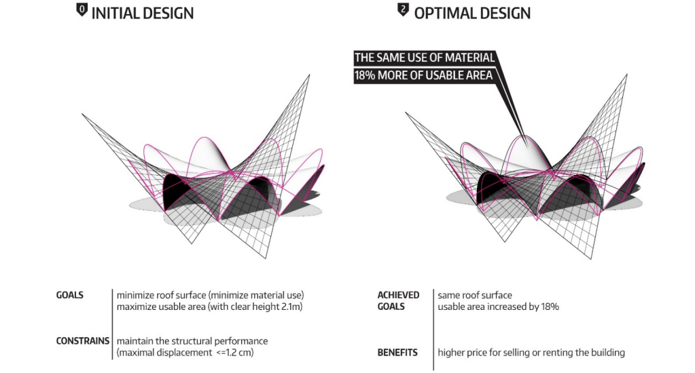
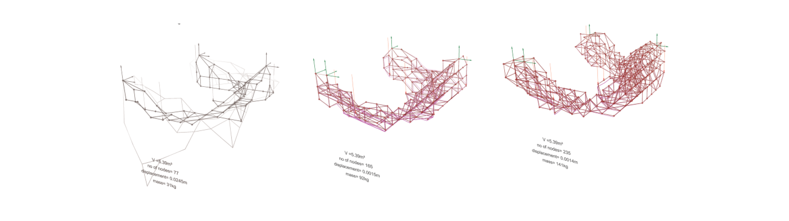

#Teaching Courses at Universities

**2021 - Assitant professor**
Wroclaw University of Science and Technology,
Department of Architecture, course "Parametric Modelling"

**2020 - Lecturer**
Structural Engineering BT2, BTU Cottbus, Fakultät 6 Digitales Entwerfen, Cottbus, DE

**2017 - Lecturer**
Universität der Künste BerlinUniversität der Künste Berlin, Berlin Area, Germany
*I was teaching a semester-long Grasshopper-based course "Interactive- Interaction-design". The course content was focused on paper folding simulations with Kangaroo 2 and their physical conterparts.*

**2015 - Adjunct/ Tutor**
Victoria University of Wellington
School of Architecture and Design, Wellington & Wairarapa, New Zealand, tutoring Design Communication Course (SARC261), tutoring parametric design workshops

# Leadership of workshops at international conferences

**AMERICAN ASSOCIATION OF COMPUTER AIDED DESIGN IN ARCHITECTURE (ACADIA 2018)**,*Recalibration of Architectural Design Optimization*, 14/10/2018, Mexico City, MX

**COMPUTER-AIDED ARCHITECTURAL DESIGN RESEARCH IN ASIA (CAADRIA 2017)**,*Workflows for Conceptual Architectural Design Optimisation (ADO)*, 03-04/04/2017, Xi'an JiaotongLiverpool University, Suzhou, CN

**INTERNATIONAL ASSOCIATION OF SPATIAL STRUCTURES 2017 (IASS 2017)**, *Interfacing Architecture, Engineering and Mathematical Optimization*, 24/09/2017, Hamburg, DE

**ADVANCES IN ARCHITECTURAL GEOMETRY 2016 (AAG 2016)**, *AJ Game from complexity to reality*, 10-11/09/2016, ETH, Zurich, CH

**SHAPES OF LOGIC 2015 (SOL 2015)**
*Min- max structures*, 7-11/03/2015, Wroclaw, PL

**ADVANCES IN ARCHITECTURAL GEOMETRY 2014 (AAG 2014)**, *Prototyping Optimization process in relation to solar analysis*, 20/09/2014, UCL, London, GB

#Other On-site Workshops

**1.**  *OPTIshell Workshop*, 2-day workshop organized by Fab Foundation Poland, Fab Institute, 15-16/03/2024, Wroclaw, PL

**1.**  *Sprayed Robotic Structures Workshop*, Workshop mit Tragwerksanalyse der Module, BTU Cottbus, 09/2019 (5 x 5 hours), Cottbus, DE

**2.** Optimization workshops as part of the *Summer School Dresden*, TU Dresden, led by: Judyta Cichocka, 20/08/2017, Dresden, DE

**3.** *Machine Learning workshops*, organizing committee: Judyta Cichocka, moderator: Mateusz Zwierzycki, 06-08/10/2017 (3 days), TU Center of Entrepreneurship, Berlin, DE

**4.** *Canopy structural optimization workshop*, organizing committee: Judyta Cichocka, Jan Pernecky (ReseArch), moderator: Judyta Cichocka, 14/01/2017 (1 day), online webinar

**5.** *Winter School 2016 workshop* - Zakopane 2016, organizing committee: Judyta Cichocka, Adrian Krężlik, form of participation: co-organizer and workshop leader, 28/02-01/03/2016 (3 days), Zakopane, PL

**6.** *OPTIwaw 2016 workshop*, organizing committee: Judyta Cichocka, Adrian Krężlik, form of participation: co-organizer and workshop leader, 21-22/05/2016 (2 days), Business and Conference Center, Ogrodowa 58, Warsaw, PL

**7.** *Grasshopper Master Class for ARCI-412*, organizing committee: Judyta Cichocka, Derek Kawiti, 1-2/08/2014 (2 days), Victoria University of Technology, School of Architecture, lab 319, Wellington, NZ

**8.** *Advance Grasshopper Masterclass for Master Thesis Students*, organizing committee: Derek Kawiti, Judyta Cichocka, form of participation: co-organizer and workshop leader, 16/08/2015 (1 day), Victoria University of Technology, Wellington, NZ

**9.** *Parametric design workshop Course 2*: Intermediate level + physical simulations, Organizing committee: Judyta Cichocka, Piotr Halczuk, 18-19/10/2014 (2 days), Biskupia 10/2, Kraków, PL

**10.** *Parametric design workshops Course 1*: Basic level + optimization, Organizing committee: Judyta Cichocka, Piotr Halczuk, 11-12/10/2014 (2 days), Św.Filipa 23/6, Kraków, PL

**11.** *Generative forms in art and architecture*, Lower Silesian Science Festival 2014, organizing committee: Judyta Cichocka, Jakub Ławicki, 23-24/09/2014 (2 days), C13, Wrocław University of Science and Technology, Wrocław, PL

**12.** *Code of Space parametric design course - Wrocław: Course 2* - intermediate level + solar optimization, organizing committee: Judyta Cichocka, co-organizers: Mateusz Zwierzycki (Poznań University of Technology), 3D-UP company, media patrons: 3DD Dreaming, 12-14/09/ 2014 (3 days), Krzywy Komin Professional Development Center, Wrocław, PL

**13.** *Code of Space parametric design course - Wrocław: 1-basic level course*, organizing committee: Judyta Cichocka, co-organizers: Mateusz Zwierzycki (Poznań University of Technology), 3D-UP company, media patrons: 3DD Dreaming, 5-7/09/2014 (3 days) ), Krzywy Komin Professional Development Center, Wrocław, PL

**14.** *3D Printing training*, organizing committee: KN LabDigiFab, Bolesław Telesiński, Judyta Cichocka, 5/11/2013 (1 day), Wrocław University of Science and Technology, Faculty of Architecture, Building E-5, room 8, Wrocław, PL

**15.** *Parametric design workshops - basic level + optimization*, organizing committee: Judyta Cichocka, Marta Pakowska, Mateusz Olczyk, 15/11/2013-17/11/2013 (3 days), Wrocław University of Science and Technology, Faculty of Architecture, Wrocław, PL

#Online Trainings
**Karamba 101:** Introduction to Parametric Engineering
[link](https://www.thinkparametric.com/courses/karamba-101-introduction-to-parametric-engineering)

**Karamba 102:** - Optimizzation of concrete shells and form finding techniques.
[link](https://www.thinkparametric.com/courses/karamba-102)

**ARX.ace** - Optimization: CANOPY STRUCTURE OPTIMIZATION [link](https://arxace.com/courses/optimization-canopy-structure-optimization/)

#Supervising and mentoring

I was for many years an official supervisor of the research group LabDigiFab at Wroclaw University of Technology and Science. Between 2016 and 2018 I was Young Talent Architecture Award (YTAA) Representative for the Faculty of Architecture at Wroclaw University of Science and Technology. One of the nominated by me projects S’lowtecture: housing structure by Tomasz Broma won in the completion and was presented at 15th International Architecture Exhibition– La Biennale di Venezia.
